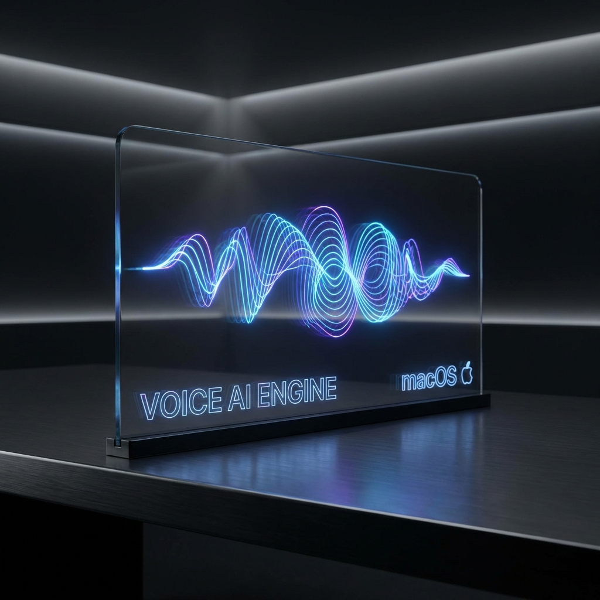

# EchoCore Pro



<div align="center">

[](https://www.apple.com/macos)
[](https://swift.org)
[](https://developer.apple.com/metal/)
[](LICENSE)

**The Ultimate Local Voice Intelligence Engine.**  
*Private. Accelerated. Beautiful.*

</div>

---

## 🌌 Overview

**EchoCore Pro** is a state-of-the-art, native macOS application designed to bring powerful voice AI capabilities directly to your machine. By combining the elegance of **SwiftUI** with the raw power of **Metal** acceleration, EchoCore Pro enables real-time, offline voice synthesis and processing without a single byte leaving your device.

Built for developers, creators, and privacy enthusiasts who demand low-latency performance and absolute control.

## ✨ Key Features

*   **🚀 Metal-Accelerated Inference**  
    Harness the full power of Apple Silicon (M1/M2/M3) with optimized shaders for sub-second, real-time voice synthesis.

*   **🔒 Total Privacy (Offline First)**  
    No cloud reliance. Your voice data never leaves your local machine. Download models once, run them forever.

*   **💎 Premium Native Interface**  
    A sleek, futuristic SwiftUI interface designed for macOS Sonoma. Features glassmorphism, fluid animations, and a focus on usability.

*   **🎛️ Audio Workbench**  
    Integrated professional audio post-processing tools including de-essing, parametric EQ, and dynamic normalization.

*   **📦 Model Management**  
    One-click download and quantization of state-of-the-art open-source voice models into optimized formats for Apple Silicon.

## 🛠️ Architecture

EchoCore Pro utilizes a hybrid architecture to deliver the best of both worlds:

1.  **Frontend (SwiftUI)**: Handles UI, user interaction, audio visualization, and Metal rendering.
2.  **Core (Swift Data)**: Manages local persistence for models, history, and settings.
3.  **Engine (Python Bridge)**: Orchestrates advanced ML models (like OpenVoice) running in a deeply integrated, managed environment.

## 🚀 Getting Started

### Prerequisites
*   macOS 14.0 (Sonoma) or higher
*   Apple Silicon (M1/M2/M3 recommended)
*   16GB+ RAM recommended for large models

### Installation

1.  **Clone the Repository**
    ```bash
    git clone https://github.com/salvadalba/nodaysidle-echocore-pro.git
    cd nodaysidle-echocore-pro
    ```

2.  **Setup Environment**
    Run the automated setup script to configure the local Python environment and dependencies:
    ```bash
    ./Scripts/setup_venv.sh
    ```

3.  **Build**
    Open `EchoCorePro/EchoCorePro.xcodeproj` in Xcode 15+ and build the target `EchoCorePro`.

## 🤝 Contributing

We welcome contributions to making local AI accessible and beautiful. Please verify that your code adheres to our SwiftLint rules and includes unit tests for new features.

1.  Fork the Project
2.  Create your Feature Branch (`git checkout -b feature/AmazingFeature`)
3.  Commit your Changes (`git commit -m 'Add some AmazingFeature'`)
4.  Push to the Branch (`git push origin feature/AmazingFeature`)
5.  Open a Pull Request

## 📜 License

Distributed under the MIT License. See `LICENSE` for more information.

---

<div align="center">
  <sub>Built with broken sleep and caffeine by salvadalba.</sub>
</div>
